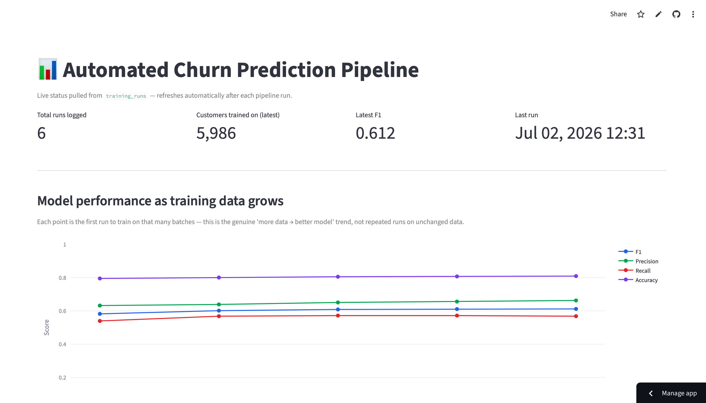
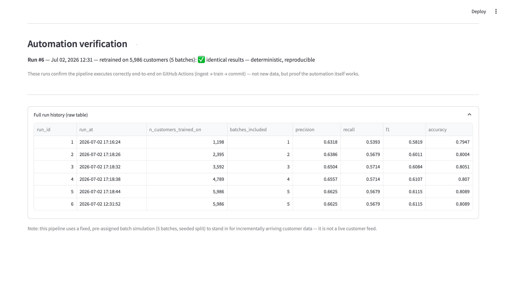

# 📊 Automated Churn Prediction Pipeline

An end-to-end ML pipeline that retrains a customer churn model on incrementally arriving data, on a schedule, with zero manual intervention — tracked live via a Streamlit dashboard.

**Stack:** Python · scikit-learn · GitHub Actions · SQLite · Streamlit

**Live dashboard:** [churn-pipeline-26.streamlit.app](https://churn-pipeline-26.streamlit.app)

---

## 🧭 Overview

Most "churn prediction" portfolio projects stop at a single notebook that trains one model once. This project's focus is different: the automation itself is the centerpiece.

- New batches of customer data are ingested and the model is retrained automatically via GitHub Actions, on both a schedule and manual trigger.
- Every run's metrics (precision, recall, F1, accuracy, confusion matrix) are logged to a SQLite table.
- A Streamlit dashboard reads that table live to show pipeline status, run history, and F1 trend — so you can verify the automation is actually working, not just trust that it is.

**Dataset**: [Telco Customer Churn](https://www.kaggle.com/datasets/blastchar/telco-customer-churn), fed in incremental batches to simulate data arriving over time.

---

## 🏗️ Architecture

```
data arrives (batch)
        │
        ▼
 src/ingest.py  ──────► appends new customers to working dataset
        │
        ▼
 src/train.py   ──────► sklearn Pipeline (preprocessing + LogisticRegression)
        │                trains on all data seen so far
        ▼
 SQLite: training_runs ──► run_id, run_at, n_customers_trained_on,
        │                   batches_included, precision, recall,
        │                   f1, accuracy, tn, fp, fn, tp
        ▼
 Streamlit dashboard ──► pipeline status, F1 trend, automation verification
```

Retraining is triggered by `.github/workflows/retrain.yml` — both on a schedule and via manual `workflow_dispatch`. Each run shows up as a `github-actions[bot]` commit in the repo history, which is the actual proof the automation runs in the cloud rather than just on a local machine.

---

## 📈 Results (5 retraining runs, real data from `training_runs`)

| Batches | Customers | Precision | Recall | F1 | Accuracy |
|---|---|---|---|---|---|
| 1 | 1,198 | 0.6318 | 0.5393 | 0.5819 | 0.7947 |
| 2 | 2,395 | 0.6386 | 0.5679 | 0.6011 | 0.8004 |
| 3 | 3,592 | 0.6504 | 0.5714 | 0.6084 | 0.8051 |
| 4 | 4,789 | 0.6557 | 0.5714 | 0.6107 | 0.8070 |
| 5 | 5,986 | 0.6625 | 0.5679 | 0.6115 | 0.8089 |

F1 improved monotonically from **0.582 → 0.612** (+5%) as more data was incorporated across the 5 runs. Precision improved more consistently than recall, which plateaued around 0.54–0.57 (see Limitations).

> A 6th run (same 5 batches, re-triggered via GitHub Actions) produced **identical metrics** — expected, since training is deterministic on unchanged data. Kept in the dashboard as automation-verification proof, not counted as a distinct data point in the trend above.

---

## 🖥️ Dashboard

The Streamlit app shows:
- Pipeline status (total runs logged, latest F1, last run timestamp)
- F1 / precision / recall / accuracy trend as training data grows
- Automation verification (confirms runs came from GitHub Actions, not local execution)

**Dashboard Overview:**



**Automation Verification:**



---

## 📁 Repo structure

```text
churn-pipeline/
│
├── .github/
│   └── workflows/
│       └── retrain.yml          # GitHub Actions workflow for automated retraining
│
├── data/
│   ├── raw/
│   │   └── telco_churn_full.csv # Source dataset
│   └── pipeline.db              # SQLite database used by the pipeline
│
├── models/
│   └── model.pkl                # Trained churn prediction model
│
├── screenshots/
│
├── src/
│   ├── app.py                   # Streamlit dashboard
│   ├── ingest.py                # Data ingestion pipeline
│   └── train.py                 # Model training script
│
├── .gitignore
├── README.md
└── requirements.txt
```
---

## ▶️ Running it locally

```bash
git clone https://github.com/NehaKadam26/churn-pipeline.git
cd churn-pipeline
pip install -r requirements.txt

# run a training cycle manually
python src/train.py

# launch the dashboard
streamlit run app.py
```

Scheduled/manual retraining in the cloud is handled by the GitHub Actions workflow — see the **Actions** tab in the repo for run history.

---

## ⚠️ Limitations

- **Only 5 retraining runs so far** — the F1 improvement trend (0.582 → 0.612) is real but based on a small number of batches, not a long-running production history.
- **Batches are simulated**, not truly live incremental data — a fixed dataset was split and fed in over time to demonstrate the automation pattern, not sourced from a real streaming pipeline.
- **Recall plateaus (~0.54–0.57)** while precision improves more with additional data — worth investigating further (e.g. class imbalance handling, threshold tuning) rather than something the current pipeline solves.
- **Timestamp inconsistency**: local runs are logged in IST while GitHub Actions runs are logged in UTC; `run_at` values are not yet normalized to a single timezone.

---

## 🛣️ Roadmap

- Normalize timestamps to a single timezone
- Add more batches to see whether the F1 trend holds beyond 5 runs
- Investigate recall plateau (class weighting, threshold tuning)
